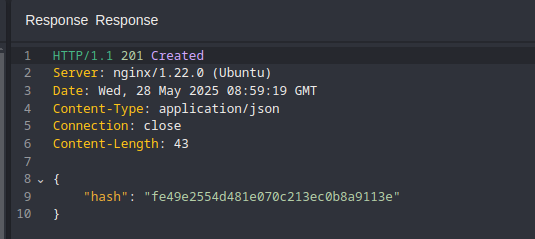

## Initial Approach 
While exploring the target website, I noticed it appeared to be a platform for registering accounts to watch movies. There was an option to request an **access code** via email.

Out of curiosity, I tried entering a random email like `admin@nahamcon.ctf`. The response I received was interesting: access codes could only be requested for emails ending in `@movieservice.ctf`.


Next, I submitted `admin@movieservice.ctf` to see how the system would behave with a valid domain. The application accepted the email and prompted me to enter a **6-digit access code** for verification.

I entered random 6-digit codes, but unsurprisingly, they resulted in an “Invalid Code” error. I briefly considered brute-forcing the code, but quickly dismissed the idea due to time constraints and inefficiency. Instead, I decided to dig into the client-side JavaScript files to see if there was another way in.

```javascript

async function verifyCode() {
    const code = document.getElementById('code').value;
    if (code.length === 6) {
        try {
            const response = await fetch('/api/validate/', {
                method: 'POST',
                headers: { 'Content-Type': 'application/json' },
                body: JSON.stringify({ code })
            });
            const data = await response.json();
            if (response.ok && data.user_id) {
                const tokenResponse = await fetch('/api/screen-token', {
                    method: 'POST',
                    headers: { 'Content-Type': 'application/json' },
                    body: JSON.stringify({ user_id: data.user_id })
                });
                const tokenData = await tokenResponse.json();
                if (tokenResponse.ok && tokenData.hash) {
                    window.location.href = `/screen/?key=${tokenData.hash}`;
                } else {
                    alert("Failed to retrieve screening token.");
                }
            } else {
                alert("Invalid code. Please try again.");
            }
        } catch (error) {
            console.error("Error verifying code:", error);
        }
    }
```
- `/api/validate/`: Accepts a 6-digit code and returns a `user_id` if valid.
- `/api/screen-token`: Accepts a `user_id` and returns a `hash` (a screening token).
- `/screen/?key=<hash>`: Loads the final screen using the token in the query string.
These endpoints offered a new attack surface, so I decided to test them further.

## Exploring the `/api/screen-token` Endpoint
I manually visited the `/api/screen-token` endpoint and was immediately met with an error saying the `user_id` was missing:

To test further, I crafted a POST request including a sample `user_id`:

The response came back with a status message indicating the user was "deactivated."
This hinted that while `user_id` 1 was disabled, there might be other user IDs that were active. So, I began fuzzing `user_id` values sequentially.


Eventually, I received a valid response that contained the expected `hash` token.
## Retrieving the Flag

Knowing that the `/screen/?key=<hash>` endpoint accepts the token in the query string, I navigated to:

```
/screen/?key=fe49e2554d481e070c213ec0b8a9113e

```

Boooom, I was greeted with the **flag**.


## Takeaways
- **Client-side JavaScript** is often a goldmine for discovering hidden endpoints and logic.
- Instead of brute-forcing, always consider what information the frontend might be exposing.
- Fuzzing parameter values (like `user_id`) can reveal access tokens or other valuable data points in improperly protected APIs.